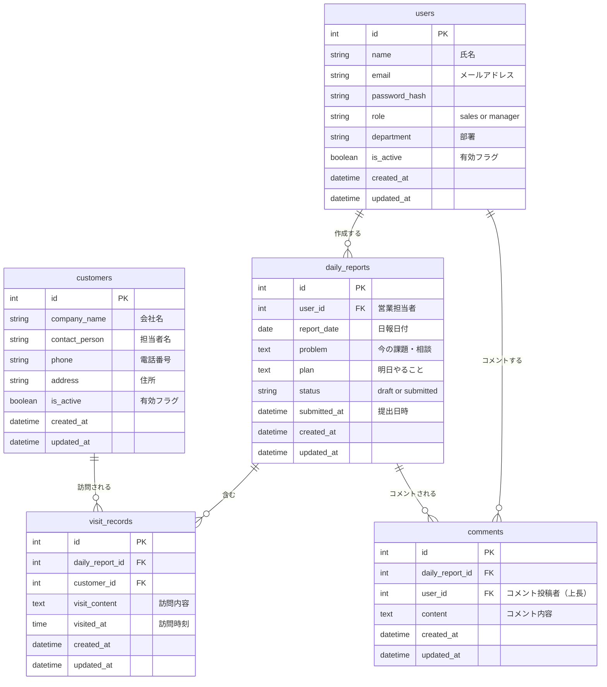

```mermaid
erDiagram
    users {
        int id PK
        string name "氏名"
        string email "メールアドレス"
        string password_hash
        string role "sales or manager"
        string department "部署"
        boolean is_active "有効フラグ"
        datetime created_at
        datetime updated_at
    }

    customers {
        int id PK
        string company_name "会社名"
        string contact_person "担当者名"
        string phone "電話番号"
        string address "住所"
        boolean is_active "有効フラグ"
        datetime created_at
        datetime updated_at
    }

    daily_reports {
        int id PK
        int user_id FK "営業担当者"
        date report_date "日報日付"
        text problem "今の課題・相談"
        text plan "明日やること"
        string status "draft or submitted"
        datetime submitted_at "提出日時"
        datetime created_at
        datetime updated_at
    }

    visit_records {
        int id PK
        int daily_report_id FK
        int customer_id FK
        text visit_content "訪問内容"
        time visited_at "訪問時刻"
        datetime created_at
        datetime updated_at
    }

    comments {
        int id PK
        int daily_report_id FK
        int user_id FK "コメント投稿者（上長）"
        text content "コメント内容"
        datetime created_at
        datetime updated_at
    }

    users ||--o{ daily_reports : "作成する"
    daily_reports ||--o{ visit_records : "含む"
    customers ||--o{ visit_records : "訪問される"
    daily_reports ||--o{ comments : "コメントされる"
    users ||--o{ comments : "コメントする"
```
