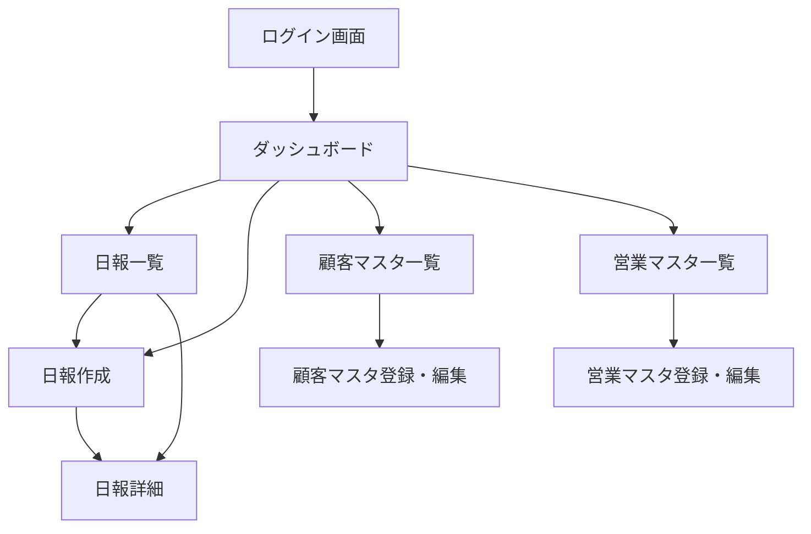

# 営業日報システム 画面定義書

---

## 画面一覧

| 画面ID | 画面名 | URL | アクセス権限 |
|--------|--------|-----|-------------|
| SCR-01 | ログイン画面 | `/login` | 全員（未認証） |
| SCR-02 | ダッシュボード | `/` | 営業・上長 |
| SCR-03 | 日報一覧画面 | `/reports` | 営業・上長 |
| SCR-04 | 日報作成・編集画面 | `/reports/new` `/reports/:id/edit` | 営業 |
| SCR-05 | 日報詳細画面 | `/reports/:id` | 営業・上長 |
| SCR-06 | 顧客マスタ一覧画面 | `/customers` | 営業・上長 |
| SCR-07 | 顧客マスタ登録・編集画面 | `/customers/new` `/customers/:id/edit` | 上長 |
| SCR-08 | 営業マスタ一覧画面 | `/users` | 上長 |
| SCR-09 | 営業マスタ登録・編集画面 | `/users/new` `/users/:id/edit` | 上長 |

---

## 画面遷移図

---

## 各画面定義

---

### SCR-01 ログイン画面

**概要**：システムへのログインを行う画面。

**アクセス権限**：未認証ユーザー（認証済みの場合はダッシュボードへリダイレクト）

#### 入力項目

| 項目名 | 型 | 必須 | バリデーション |
|--------|-----|------|--------------|
| メールアドレス | text | ○ | メール形式 |
| パスワード | password | ○ | 8文字以上 |

#### アクション

| アクション | 説明 | 遷移先 |
|-----------|------|--------|
| ログイン | 認証を行う | 成功時 → SCR-02 / 失敗時 → エラーメッセージ表示 |

---

### SCR-02 ダッシュボード

**概要**：ログイン後のトップ画面。自分の最近の日報と未読コメントを確認できる。

**アクセス権限**：営業・上長

#### 表示内容

| エリア | 説明 |
|--------|------|
| 今日の日報ステータス | 当日の日報が作成済み／下書き／未作成かを表示 |
| 最近の日報一覧 | 直近5件の日報（日付・ステータス・コメント件数） |
| 未読コメント通知 | 自分の日報への未読コメントの件数（上長のみ：自分がコメントしていない提出済み日報件数） |

#### アクション

| アクション | 説明 | 遷移先 |
|-----------|------|--------|
| 今日の日報を作成 | 当日日付で日報作成画面を開く | SCR-04 |
| 日報一覧を見る | 日報一覧へ遷移 | SCR-03 |
| 日報行をクリック | 該当日報の詳細へ遷移 | SCR-05 |

---

### SCR-03 日報一覧画面

**概要**：日報の一覧を表示する。営業は自分の日報のみ、上長は全営業の日報を閲覧可能。

**アクセス権限**：営業・上長

#### 検索・フィルタ項目

| 項目名 | 型 | 説明 |
|--------|-----|------|
| 期間（開始） | date | 日報日付の絞り込み |
| 期間（終了） | date | 日報日付の絞り込み |
| 担当者 | select | 上長のみ表示。営業担当者で絞り込み |
| ステータス | select | すべて／下書き／提出済み |

#### 一覧表示項目

| 項目名 | 説明 |
|--------|------|
| 日付 | 日報の日付 |
| 担当者名 | 日報を作成した営業担当者（上長のみ表示） |
| ステータス | 下書き／提出済み |
| 訪問件数 | 訪問記録の件数 |
| コメント件数 | 上長コメントの件数 |
| 更新日時 | 最終更新日時 |

#### アクション

| アクション | 説明 | 遷移先 |
|-----------|------|--------|
| 新規作成 | 日報作成画面へ遷移 | SCR-04 |
| 行をクリック | 日報詳細へ遷移 | SCR-05 |

---

### SCR-04 日報作成・編集画面

**概要**：日報を新規作成または編集する画面。

**アクセス権限**：営業（自分の日報のみ編集可）

#### 入力項目

**基本情報**

| 項目名 | 型 | 必須 | 備考 |
|--------|-----|------|------|
| 日付 | date | ○ | 新規作成時は本日の日付をデフォルト設定 |

**訪問記録（複数行追加可能）**

| 項目名 | 型 | 必須 | 備考 |
|--------|-----|------|------|
| 訪問先顧客 | select | ○ | 顧客マスタから選択 |
| 訪問時刻 | time | - | 任意入力 |
| 訪問内容 | textarea | ○ | 自由記述 |

**課題・計画**

| 項目名 | 型 | 必須 | 備考 |
|--------|-----|------|------|
| 今の課題・相談（Problem） | textarea | - | 自由記述 |
| 明日やること（Plan） | textarea | - | 自由記述 |

#### アクション

| アクション | 説明 | 遷移先 |
|-----------|------|--------|
| 訪問記録を追加 | 訪問記録の入力行を1行追加する | 同画面 |
| 訪問記録を削除 | 対象行を削除する | 同画面 |
| 下書き保存 | ステータス「下書き」で保存 | SCR-05 |
| 提出 | ステータス「提出済み」で保存 | SCR-05 |
| キャンセル | 編集を破棄して戻る | SCR-03 |

#### バリデーション

- 同一日付の日報が既に存在する場合はエラー表示
- 訪問記録が1行もない場合、提出時に警告を表示
- 日付は未来日付を不可とする

---

### SCR-05 日報詳細画面

**概要**：日報の詳細内容と上長コメントを確認する画面。

**アクセス権限**：営業（自分の日報のみ）・上長（全営業の日報）

#### 表示内容

**基本情報**

| 項目名 | 説明 |
|--------|------|
| 担当者名 | 日報作成者 |
| 日付 | 日報の日付 |
| ステータス | 下書き／提出済み |
| 提出日時 | 提出された日時 |

**訪問記録一覧**

| 項目名 | 説明 |
|--------|------|
| 訪問先顧客名 | 顧客マスタの会社名・担当者名 |
| 訪問時刻 | 訪問時刻（入力がある場合） |
| 訪問内容 | 訪問内容の本文 |

**課題・計画**

| 項目名 | 説明 |
|--------|------|
| 今の課題・相談（Problem） | 入力内容 |
| 明日やること（Plan） | 入力内容 |

**コメント欄**

| 項目名 | 説明 |
|--------|------|
| コメント一覧 | 投稿者名・投稿日時・コメント内容を時系列で表示 |
| コメント入力欄 | 上長のみ表示。テキストエリアと投稿ボタン |

#### アクション

| アクション | 権限 | 説明 | 遷移先 |
|-----------|------|------|--------|
| 編集 | 営業（下書きのみ） | 編集画面へ遷移 | SCR-04 |
| コメント投稿 | 上長 | コメントを投稿する | 同画面（再読込） |
| 一覧へ戻る | 全員 | 日報一覧へ戻る | SCR-03 |

---

### SCR-06 顧客マスタ一覧画面

**概要**：登録されている顧客の一覧を表示・管理する画面。

**アクセス権限**：営業（参照のみ）・上長（登録・編集・無効化）

#### 検索・フィルタ項目

| 項目名 | 型 | 説明 |
|--------|-----|------|
| 会社名 | text | 部分一致検索 |
| 有効フラグ | select | すべて／有効のみ／無効のみ |

#### 一覧表示項目

| 項目名 | 説明 |
|--------|------|
| 会社名 | 顧客の会社名 |
| 担当者名 | 顧客側の担当者名 |
| 電話番号 | 電話番号 |
| 住所 | 住所 |
| 有効フラグ | 有効／無効 |

#### アクション

| アクション | 権限 | 説明 | 遷移先 |
|-----------|------|------|--------|
| 新規登録 | 上長 | 顧客登録画面へ遷移 | SCR-07 |
| 編集 | 上長 | 顧客編集画面へ遷移 | SCR-07 |
| 無効化／有効化 | 上長 | 有効フラグを切り替える | 同画面（再読込） |

---

### SCR-07 顧客マスタ登録・編集画面

**概要**：顧客情報を新規登録または編集する画面。

**アクセス権限**：上長

#### 入力項目

| 項目名 | 型 | 必須 | バリデーション |
|--------|-----|------|--------------|
| 会社名 | text | ○ | 最大100文字 |
| 担当者名 | text | - | 最大50文字 |
| 電話番号 | text | - | 数字・ハイフンのみ |
| 住所 | text | - | 最大200文字 |

#### アクション

| アクション | 説明 | 遷移先 |
|-----------|------|--------|
| 保存 | 入力内容を保存する | SCR-06 |
| キャンセル | 編集を破棄して戻る | SCR-06 |

---

### SCR-08 営業マスタ一覧画面

**概要**：登録されているユーザー（営業・上長）の一覧を表示・管理する画面。

**アクセス権限**：上長

#### 一覧表示項目

| 項目名 | 説明 |
|--------|------|
| 氏名 | ユーザーの氏名 |
| メールアドレス | ログインID |
| ロール | 営業／上長 |
| 部署 | 所属部署 |
| 有効フラグ | 有効／無効 |

#### アクション

| アクション | 説明 | 遷移先 |
|-----------|------|--------|
| 新規登録 | ユーザー登録画面へ遷移 | SCR-09 |
| 編集 | ユーザー編集画面へ遷移 | SCR-09 |
| 無効化／有効化 | 有効フラグを切り替える | 同画面（再読込） |

---

### SCR-09 営業マスタ登録・編集画面

**概要**：ユーザー情報を新規登録または編集する画面。

**アクセス権限**：上長

#### 入力項目

| 項目名 | 型 | 必須 | バリデーション |
|--------|-----|------|--------------|
| 氏名 | text | ○ | 最大50文字 |
| メールアドレス | text | ○ | メール形式・重複不可 |
| パスワード | password | ○（新規のみ） | 8文字以上 |
| ロール | select | ○ | 営業／上長 |
| 部署 | text | - | 最大50文字 |

#### アクション

| アクション | 説明 | 遷移先 |
|-----------|------|--------|
| 保存 | 入力内容を保存する | SCR-08 |
| キャンセル | 編集を破棄して戻る | SCR-08 |

---

## 共通仕様

### ナビゲーション

| 項目 | 説明 |
|------|------|
| ヘッダー | ログインユーザー名・ロール・ログアウトボタンを常時表示 |
| サイドメニュー | ダッシュボード・日報一覧・顧客マスタ・営業マスタへのリンク（権限に応じて表示切替） |

### 権限によるUI制御

| 機能 | 営業 | 上長 |
|------|------|------|
| 自分の日報の作成・編集 | ○ | - |
| 全員の日報の閲覧 | - | ○ |
| コメント投稿 | - | ○ |
| 顧客マスタの参照 | ○ | ○ |
| 顧客マスタの登録・編集 | - | ○ |
| 営業マスタの管理 | - | ○ |

### エラー表示

- バリデーションエラーは各入力項目の下部にインライン表示
- システムエラーはページ上部にバナー表示
- 権限エラー（403）・存在しないページ（404）は専用エラー画面を表示
