# 営業日報システム 要件定義

---

## 1. システム概要

営業担当者が日々の顧客訪問・課題・翌日計画を記録し、上長がフィードバックを行うための日報管理システム。

---

## 2. 機能要件

### 2.1 日報管理

| # | 機能 | 説明 |
|---|------|------|
| F-01 | 日報作成 | 営業担当者が日付ごとに1件の日報を作成できる |
| F-02 | 訪問記録入力 | 1日報に対して訪問先・訪問内容を複数行追加できる |
| F-03 | Problem入力 | 今の課題・相談事項を自由記述で入力できる |
| F-04 | Plan入力 | 明日やることを自由記述で入力できる |
| F-05 | 日報提出 | 作成した日報を上長へ提出できる（下書き保存も可） |

### 2.2 コメント機能

| # | 機能 | 説明 |
|---|------|------|
| F-06 | コメント投稿 | 上長が日報に対してコメントを投稿できる |
| F-07 | コメント複数投稿 | 1つの日報に複数のコメントを追加できる |

### 2.3 マスタ管理

| # | 機能 | 説明 |
|---|------|------|
| F-08 | 顧客マスタ管理 | 顧客の登録・編集・無効化ができる |
| F-09 | 営業マスタ管理 | 営業担当者・上長の登録・編集ができる |

---

## 3. 業務ルール

- 日報は **1営業担当者 × 1日 = 1件** のみ作成可能
- 訪問記録は **1日報につき複数行** 追加可能
- コメントは **上長ロールのユーザーのみ** 投稿可能
- 日報ステータス：`下書き（draft）` → `提出済み（submitted）`

---

## 4. ER図

```mermaid
erDiagram
    users {
        int id PK
        string name "氏名"
        string email "メールアドレス"
        string password_hash
        string role "sales or manager"
        string department "部署"
        boolean is_active "有効フラグ"
        datetime created_at
        datetime updated_at
    }

    customers {
        int id PK
        string company_name "会社名"
        string contact_person "担当者名"
        string phone "電話番号"
        string address "住所"
        boolean is_active "有効フラグ"
        datetime created_at
        datetime updated_at
    }

    daily_reports {
        int id PK
        int user_id FK "営業担当者"
        date report_date "日報日付"
        text problem "今の課題・相談"
        text plan "明日やること"
        string status "draft or submitted"
        datetime submitted_at "提出日時"
        datetime created_at
        datetime updated_at
    }

    visit_records {
        int id PK
        int daily_report_id FK
        int customer_id FK
        text visit_content "訪問内容"
        time visited_at "訪問時刻"
        datetime created_at
        datetime updated_at
    }

    comments {
        int id PK
        int daily_report_id FK
        int user_id FK "コメント投稿者（上長）"
        text content "コメント内容"
        datetime created_at
        datetime updated_at
    }

    users ||--o{ daily_reports : "作成する"
    daily_reports ||--o{ visit_records : "含む"
    customers ||--o{ visit_records : "訪問される"
    daily_reports ||--o{ comments : "コメントされる"
    users ||--o{ comments : "コメントする"
```

---

## 5. テーブル補足

| テーブル | 補足 |
|---------|------|
| `users` | 営業マスタを兼ねる。`role` で営業/上長を区別 |
| `customers` | 顧客マスタ。`is_active=false` で論理削除 |
| `daily_reports` | `(user_id, report_date)` にユニーク制約を付与 |
| `visit_records` | 訪問順の管理が必要な場合は `sort_order` を追加検討 |
| `comments` | 上長が複数いる場合も `user_id` で識別可能 |
